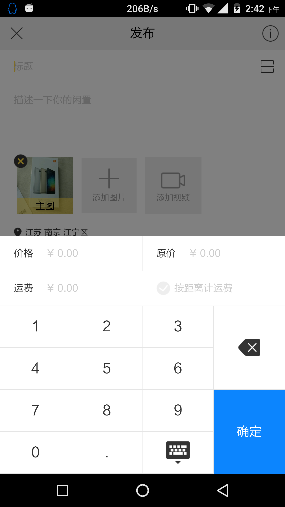
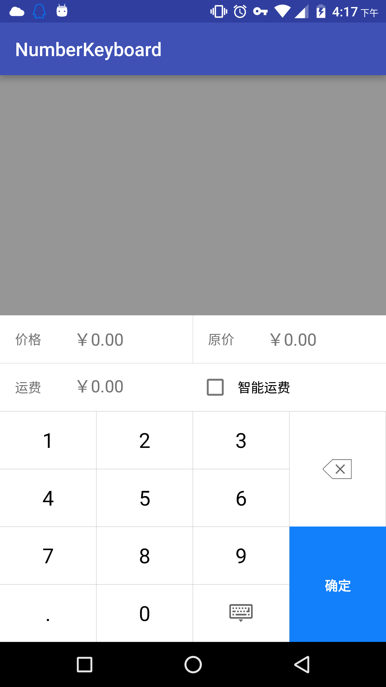
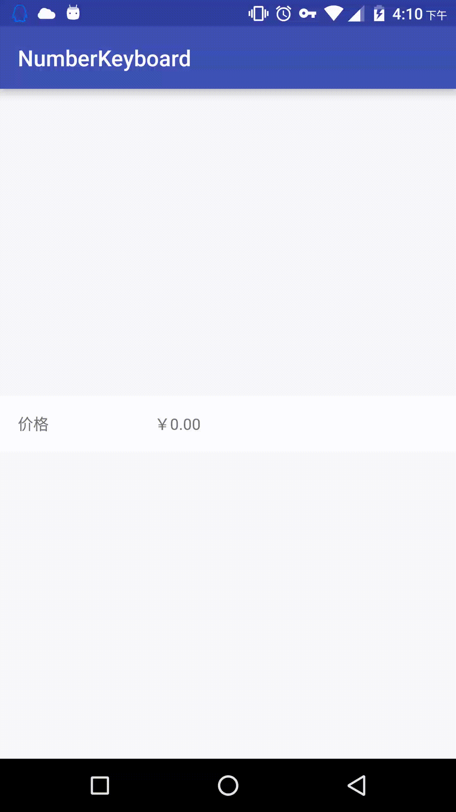
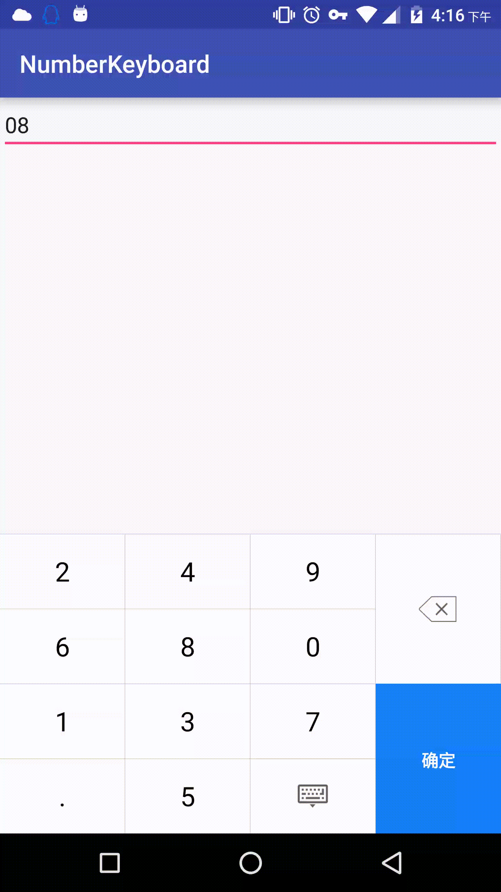

#自定义Android数字键盘Demo

###update: 
1. 增加数字键盘位置随机
2. 自定义MyKeyBoardView,实现单独设置确定按钮背景

##仿造android端闲鱼发布商品时候选择价格 弹出的数字键盘。

###闲鱼效果图

###自己写的Demo效果图如下

###增加随机数字键盘
 增加速记数字键盘，用于输入安全级别高的密码输入
 
 

 

使用的android系统的api，keyboardview和keyboard，

